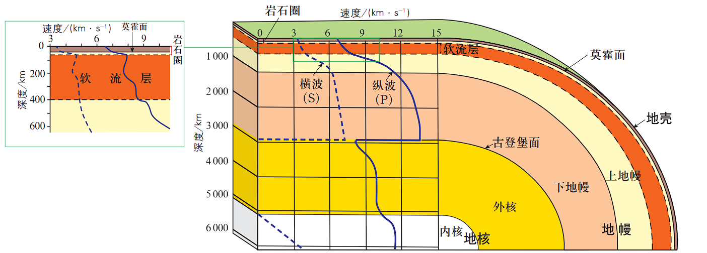
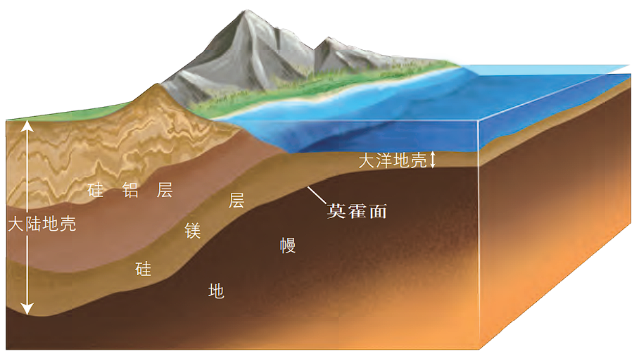
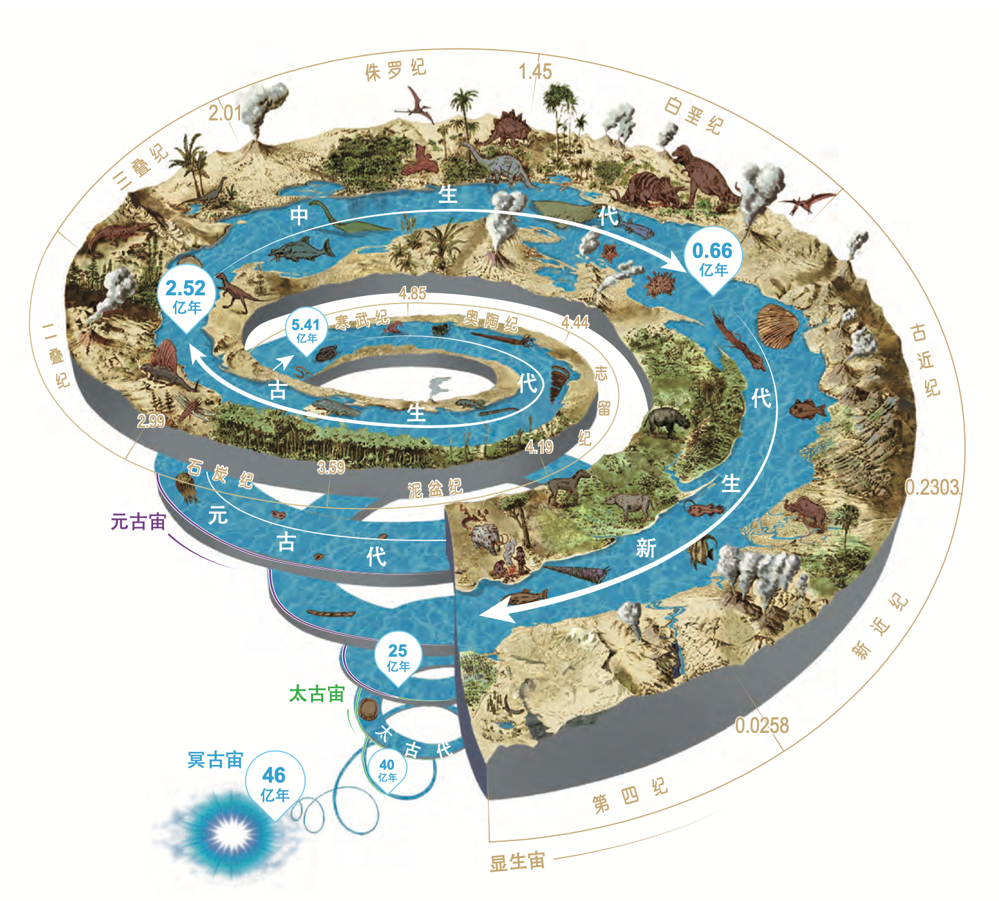

import { Callout } from "nextra-theme-docs";

# 第一章 行星地球

## 主题 1 地球的宇宙环境

### 地球在宇宙中

大小/尺度：地月系 $\lt$ 太阳系 $\lt$ 银河系 $\lt$ 可观测宇宙

### 太阳系八大行星

按照与太阳的远近依次为：水金地火木土星，天王海王星。

运行特点：

- 同向性
- 共面性
- 近圆性

### 太阳的分层

- 光球层：太阳大气最内层，厚度约为 $500 \text{ km}$，表面温度在 $6000 \text{ K}$ 左右。
- 色球层：大气中间层，延伸至 $\text{2100 km}$，呈玫瑰色，发出的光不及光球的千分之一。
- 日冕层：太阳大气的最外层，亮度仅为光球层的百万分之一。

### 太阳对地球的影响

#### 太阳辐射

- 源源不断地提供光和热
- 地球表面地太阳辐射大致从低纬到高纬递减
- 所有能源都直接或间接来源于太阳能
        
#### 太阳活动

太阳活动有时相对剧烈，有时相对较弱，平均 11 年为一个周期。

剧烈的太阳活动会干扰地球的大气环流，使全球性天气和气候发生异常，引发洪涝灾害等。

##### 标志

- 太阳黑子：温度较低，因此颜色相对较暗。
- 耀斑：色球表面某些突然增亮的区域，又称色球爆发，是太阳能量强烈的释放形式。
- 日珥：从色球内部猛烈喷发出来的气体柱，是太阳能量强烈的释放形式。

<small>*太阳风是太阳连续不断地向宇宙空间喷射出的高能带电粒子流，发生在日冕层。太阳风会严重影响地球的空间环境，破坏臭氧层，对人体健康也有一定的危害。</small>

<Callout type="warning">
    你不能用眼睛直接观察太阳，这样会导致严重的烧伤和视力损害。
</Callout>

### 地球适合生命存在的条件

#### 外部条件

1. 地球处于较安全的宇宙环境中。
2. 日地距离适中，使得地球表面有适宜的温度条件。

#### 自身条件

1. 地球的体积和质量适中，使地球具有适宜的大气条件。
2. 地球上有液态水。

## 主题 2 地球的圈层结构

### 地球内部圈层

人们能够直接观测到的地球内部结构情况只限于地表的岩石和来自钻井的岩芯。而目前世界上最深的钻孔也只有约 $\text{12 km}$，这对于地球来说，是极其有限的。

因此，人们需要通过研究地震波的传播速度等间接手段来研究地球内部的奥秘。

地球内部地震波的传播速度有两个明显的不连续面：一个在地下平均 $\text{33 km}$ 处，纵波（P 波）和横波（S 波）的传播速度都明显加快，叫作莫霍面；另一个在地下 $\text{2900 km}$ 处，在这里纵波传播速度突然下降，而横波完全消失，叫作古登堡面。

    
地球的内部构造（A. 莫霍面 B. 古登堡面）

    1. 大陆地壳
    2. 海洋地壳
    3. 上地幔
    4. 下地幔
    5. 外核
    6. 内核

依据地震波在地球内部不同深度传播速度的差异和变化，把地球内部从外到内划分为地壳、地幔和地核三个圈层。各圈层的物质组成、密度和温度有较大差异。

#### 地壳

地壳是地球圈层的最外层，平均厚度约为 $\text{17 km}$。大陆地壳的厚度比较大，平均为 $\text{39-41 km}$，高山、高原部分的厚度可以达到 $\text{60~70 km}$，而平原、盆地的地壳相对较薄；大洋地壳厚度较小，平均为 $\text{5-10 km}$。青藏高原是地球上地壳最厚的地方，厚度达 $\text{70 km}$ 以上。

#### 地幔

地幔呈固态，分为上地幔和下地幔，主要成分是富含铁、镁的硅酸盐类。

上地幔上部在地下 $\text{50-150 km}$ 到 $\text{250-400 km}$ 的深度，由于大量集中于此的放射性元素在衰变过程中释放出热量，形成异常高温，岩石软化，部分呈熔融状态，称为软流层（圈）。

而地壳和软流层以上的地幔部分（上地幔顶部），皆由岩石组成，统称为岩石圈。

#### 地核

地核一般分为外核和内核，分界面在地下 $\text{5100 km}$ 左右。外核的物质接近液态，主要是由铁、溴等元素组成的熔融体；内核可能是固态物质，刚性很强，由在极高压状态下结晶的铁镍合金组成。

### 地球外部圈层

#### 大气圈

地球的最外部被一层厚厚的大气包围着，连续的大气组成了地球的大气圈。大气圈范围较广，在 $2000-3000$ 千米高空仍有稀薄的气体。地下的土壤和某些岩石中也会有少量空气。

由于地心引力的作用，绝大部分的气体集中在离地面 $50$ 千米的范围内，而其中 $50%$ 的气体又集中在地面以上至 $6$ 千米以下的低空大气层中。

    
大气圈的作用：大气圈是地表自然环境和生命物质的保护层。

    - 让阳光透过
    - 保存热量，调节温度
    - 拦截流星体
    - 吸收紫外线和高能粒子流

#### 水圈

地球上的水以气态、液态和固态三种形式存在于空中、地表和地下，它们共同组成水圈。

    
水圈的物质运动和循环影响了地球上各种环境条件的变化。

    - 调节气候、净化大气
    - （流水）塑造地表形态、形成自然景观
    - 赖以生存的载体、孕育地球生物

#### 生物圈

生物圈是地球上所有生物及其生存环境的总称。

大气圈、水圈和岩石圈的存在，加上合适的温度条件，形成了适于生物生存的自然环境。

生物主要包括植物、动物和微生物。大部分的生物集中在地表以上 $100$ 米到水下 $200$ 米的大气圈、水圈、岩石圈等圈层的交界处，这里是生物圈的核心圈，厚度很薄，被形象地称为“生物膜”。

生物圈是地球大气、水和岩石长期演化、相互作用的结果，生物参与了对大气圈、水圈和岩石圈的改造，对地表物质循环、能量转换具有特殊作用。

生物圈是一个统一的整体，是地球上最大的生态系统，是所有生物共同的家园。保护生物圈就是保护我们人类自己。

<Callout>
    大气圈、水圈、生物圈以及岩石圈，彼此之间相互联系、相互制约，形成人类赖以生存和发展的自然环境。
</Callout>

## 主题 3 地球的演化过程

### 地质年代的划分

地球的演化经历了漫长的过程，且有明显的阶段性。不同的演化阶段因为沉积环境不同，出现了不同的地层。地层中往往保存了古生物的遗体和遗迹等，称为化石。

通过研究各地的地层沉积情况和化石，可以还原地球历史。正常情况下，沉积岩层总是按照时间顺序自上而下逐层排列的。不同年代的岩层一般含有不同的化石。

地质学家通过研究世界各地的地层和地层中保存的古生物化石，得出地球演化的地质年代。

地质年代分为：

    
1. 相对地质年代

    相对地质年代指各个地质事件的先后或早晚关系，主要依据地层顺序、生物演化和地壳运动的阶段来划分，类似人类历史中的朝代，其时间表述单位分别为宙、代、纪等。

    
2. 绝对地质年代

    绝对地质年代指各个地质事件发生的距今时间，是运用同位素年龄测定方法获得的，类似于人类历史上的公元纪年。

<Callout>
    在漫长的地质年代中，地球生物的演化表现为<strong>由低级到高级、由简单到复杂</strong>的特点；又具有<strong>不可逆性</strong>，呈现出螺旋上升的趋势。
</Callout>

### 地球的演化史

