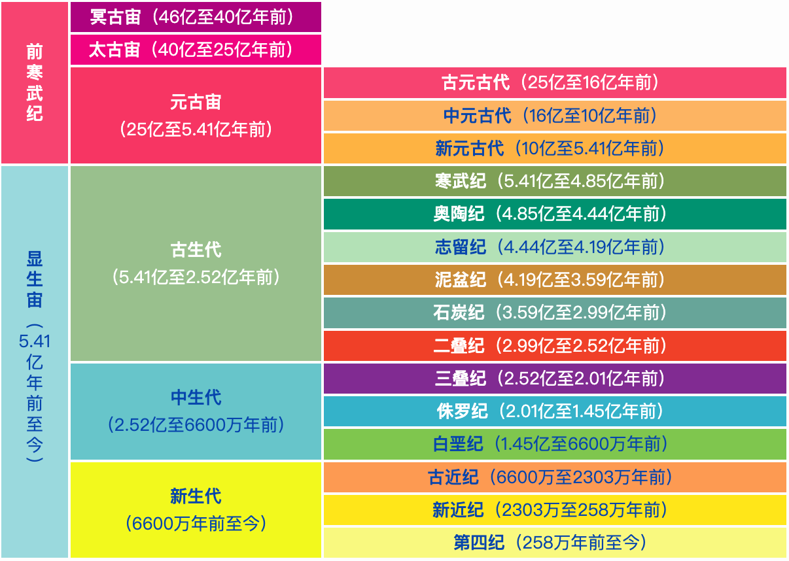

import { Callout } from "nextra-theme-docs";

# 主题3 地球的演化过程

## 地质年代的划分

地球的演化经历了漫长的过程，且有明显的阶段性。不同的演化阶段因为沉积环境不同，出现了不同的地层。地层中往往保存了古生物的遗体和遗迹等，称为化石。

通过研究各地的地层沉积情况和化石，可以还原地球历史。正常情况下，沉积岩层总是按照时间顺序自上而下逐层排列的。不同年代的岩层一般含有不同的化石。

地质学家通过研究世界各地的地层和地层中保存的古生物化石，得出地球演化的地质年代。

地质年代分为：

    
1. 相对地质年代

    相对地质年代指各个地质事件的先后或早晚关系，主要依据地层顺序、生物演化和地壳运动的阶段来划分，类似人类历史中的朝代，其时间表述单位分别为宙、代、纪等。

    
2. 绝对地质年代

    绝对地质年代指各个地质事件发生的距今时间，是运用同位素年龄测定方法获得的，类似于人类历史上的公元纪年。

<Callout>
    在漫长的地质年代中，地球生物的演化表现为<strong>由低级到高级、由简单到复杂</strong>的特点；又具有<strong>不可逆性</strong>，呈现出螺旋上升的趋势。
</Callout>

## 地球的演化史

### 冥古宙

为天文演化时期（行星形成和发展）

### 太古宙

#### 太古代

时间：40亿年前至25亿年前

特点：
1. 形成了最原始的陆核
2. 出现原始的水圈和大气圈
3. 出现原始藻类和细菌
4. 氧气逐渐增多

### 元古宙

#### 元古代

时间：25亿年前至5.41亿年前

特点：
1. 出现原始生物
2. 后期形成若干稳定的古陆
3. 原核生物进化为真核生物，单细胞生物进化为多细胞生物，海生藻类繁盛
4. 大气中形成臭氧层，为生物发展演化奠定基础

### 显生宙

#### 古生代

时间：5.41亿年前至2.52亿年前

特点：
1. 海生无脊椎动物与水生菌藻类发展
2. 晚期形成联合古陆
3. 蕨类植物大发展，成为地质历史上的成煤时期
4. 两栖类与爬行类动物占主要，由水生发展到陆生

#### 中生代

时间：2.52亿年前至6600万年前

特点：
1. 早期，环太平洋地带发生构造运动，形成我国基本大陆轮廓与一些高大山系
2. 裸子植物和爬行动物盛行
3. 是重要的成煤时期和石油生成时期

#### 新生代

时间：6600万年前至今

特点：
1. 联合古陆解体，形成现代的海陆分布格局
2. 重要的石油生成时期
3. 被子植物极其繁盛，哺乳动物大发展
4. （第四纪）发生大规模冰期，人类出现