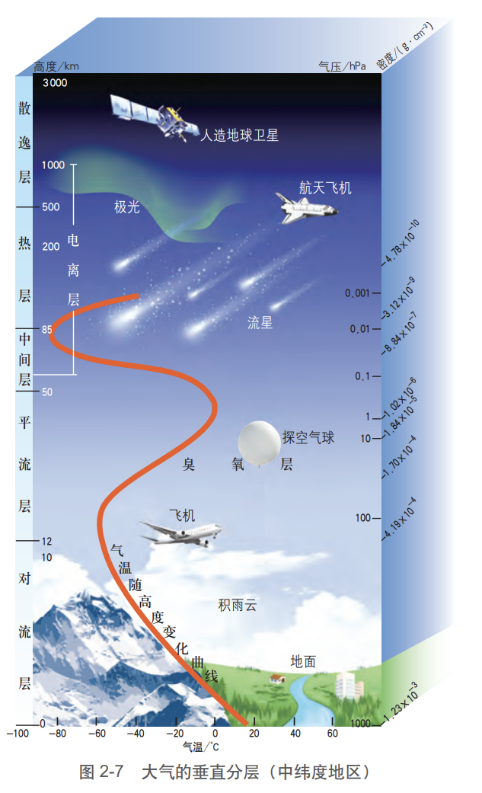

import { Callout } from "nextra-theme-docs";

# 主题4 大气的组成和垂直分层

## 大气的组成

### 干洁空气

通常将不包含水汽的纯净大气称为干洁空气，它是大气的主体，平均约占低层大气体积的99.97%。

### 水汽

水汽是大气中最重要的成分之一，它主要来自海水的蒸发，还有一部分来自地表水体的蒸发以及植物的蒸腾作用。大气中的水汽与云、雾、雨、雪以及虹等自然现象有着密切的关系。

<Callout type="info">
    在低纬度的温暖洋面上，水汽含量大；而干旱的沙漠和极地地区，水汽含量极少。一般情况下，同一地区夏季水汽含量较大。
</Callout>

### 其他成分

1. 是成云结雨的重要条件（凝结核）
2. 会加重大气污染

## 大气的垂直分层

自地面向上，随高度的增加，大气越来越稀薄，气压越来越低。大气的上界可延伸到离地面2 000～3 000千米的高度。按大气在垂直方向上的物理性质和运动状况，可把大气层分成对流层、平流层、中间层、热层和散逸层，后三层也统称为高层大气。

