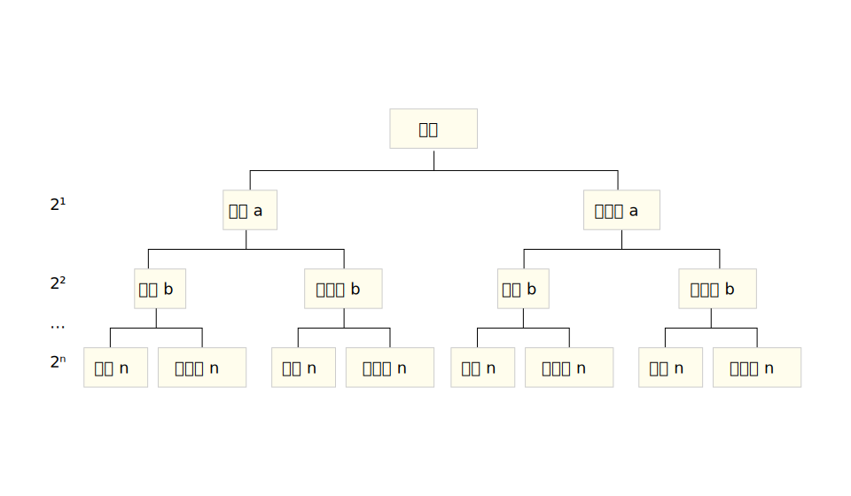
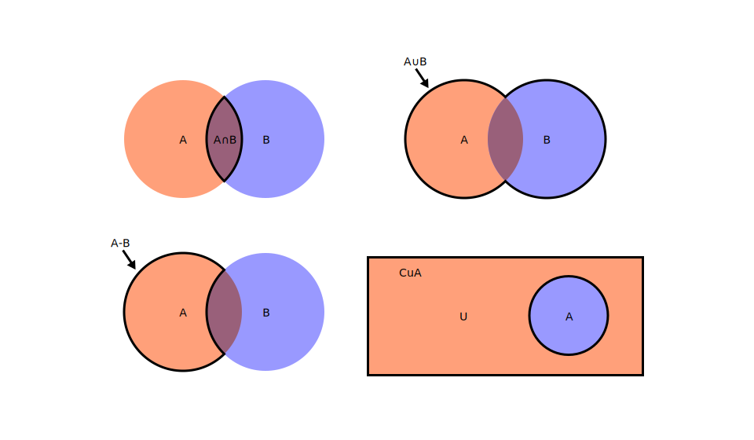

# 集合

## 概念

元素：研究对象，用小写字母表示.

集合：元素组成的总体，用大写字母表示.

常见集合表示：

| 表示方法 | 集合     | 记忆方法                    |
| -------- | -------- | --------------------------- |
| N        | 自然数集 | Natual Number 的首字母      |
| N* 或 N₊ | 正整数集 | 自然数集中的正数            |
| Z        | 整数集   | 汉语拼音 整数 首字母        |
| Q        | 有理数集 | 一切有理数都可以用 p/q 表示 |
| R        | 实数集   | Real Number 的首字母        |

表格中的记忆方法顾名思义只是为了方便记忆，不一定是这样表示的真正原因.

集合的特性：确定性（集合内元素是确定的）、互异性（集合内不存在两个相同的元素 $\{ a , b , c , \ldots , n \}$，$a \neq b \neq c \neq \cdots \neq n$）、无序性（元素顺序改变不会改变集合）.

元素与集合的关系：$a \in A$ 读作 `a 属于 A`，$a \notin A$ 读作 `a 不属于 A`.

表示集合的方法：

- 列举法：$\left\{ 1 , 2 , 3 \right\}$
- 描述法：$\left\{ x \mid P(x) \right\}$，`|` 左边表示组成集合的元素，右边是元素具有的性质.
- 区间法：$\left( 0 , 1 \right]$，圆括号 `()` 表示开区间（不含端点），方括号 `[]` 表示闭区间（含端点）.
- Venn 图

## 集合间的关系

子集：$A \subseteq B$，读作 `A 包含于 B`，表示 $A$ 中所有的元素 $B$ 中都有.

任何一个集合都是它本是的子集.

若 $A \subseteq B$，$B \subseteq A$，则 $A = B$.

真子集：$A \subseteq B$，但 $\exists x \in B$ 且 $x \notin A$，则 $A \subsetneqq B$，读作 `A 真包含于 B`，就是在集合子集的基础上排除了与它本身相等的集合.

空集：$\varnothing$，不含任何元素的集合，是任何集合的子集，是任何非空集合的真子集.

集合的子集数量：$2^n$ 个，推导如下：

设集合 $A = \left\{ a , b , c , \ldots , n \right\}$，$\mathrm{card} (A) = n$，集合中的 $n$ 个元素在它的子集中，都有包含和不包含两种可能，所以说集合的子集一共有 $2^n$ 个，画个树状图更容易理解：

接着可以得出，集合的真子集有 $2^n - 1$ 个，集合的非空子集有 $2^n - 1$ 个，集合的非空真子集有 $2^n - 2$ 个.

## 集合的运算

交集 $A \cap B$，并集 $A \cup B$，差集 $A - B$，补集 $\complement_{u} A$.

