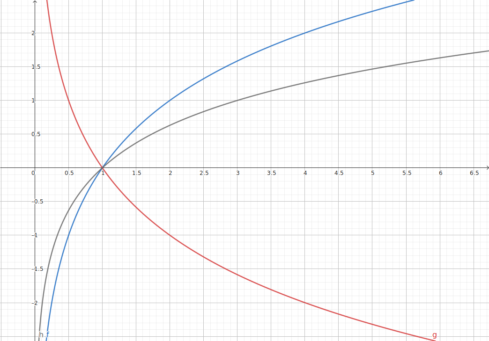

# 函数

## 初学函数

### 函数的定义

$y = f(x)$，$x \in A$.

$A$ 为定义域，$\left\{ f(x) \mid x \in A \right\}$ 为值域，$f$ 为对应关系.

### 单调性

单调递增：函数 $f(x)$ 定义域为 $I$，区间 $D \subseteq I$，$\forall x_1 , x_2 \in D$，当 $x_1< x_2$ 时，都有 $f(x_1) < f(x_2)$.

等价定义：$\forall x_1 , x_2 \in D$，都有 $(f(x_1) - f(x_2)) (x_1 - x_2) > 0$ 或 $\frac{ f(x_1) - f(x_2) }{ x_1 - x_2 } > 0$.

单调递减：函数 $f(x)$ 定义域为 $I$，区间 $D \subseteq I$，$\forall x_1 , x_2 \in D$，当 $x_1 < x_2$ 时，都有 $f(x_1) > f(x_2)$.

等价定义：$\forall x_1 , x_2 \in D$，都有 $(f(x_1) - f(x_2)) (x_1 - x_2) < 0$ 或 $\frac{f(x_1) - f(x_2)}{ x_1 - x_2 } < 0$.

在定义域内，若函数单调递增则是增函数，若单调递减则是减函数.

### 奇偶性

偶函数：函数图像关于 $y$ 轴对称.

设 $f(x)$ 定义域为 $I$，如果 $\forall x \in I$，都有 $-x \in I$，且 $f(-x) = f(x)$，那么 $f(x)$ 是偶函数.

奇函数：函数图像关于原点对称.

设 $f(x)$ 定义域为 $I$，如果 $\forall x \in I$，都有 $-x \in I$，且 $f(-x) = -f(x)$，那么 $f(x)$ 是奇函数.

从图像上看，$f(-x)$ 就是 $f(x)$ 关于 $y$ 轴对称后的函数，$-f(x)$ 就是 $f(x)$ 关于 $x$ 轴对称后的函数.

$-f(x)$ 是 $f(x)$ 关于 $x$ 轴对称后的函数很好理解，自变量值不变，因变量为相反数.

$f(-x)$ 是 $f(x)$ 关于 $y$ 轴对称后的函数，证明如下：

令 $t = -x$，$f(t) = f(x)$ 时，$t = x$，这个很好理解，因为两个函数解析式相同.

而 $t = -x$，也就是说，$x = -x$ 时，两个函数因变量相等，也就是关于 $y$ 轴对称了.

所以说，将 $y$ 轴一侧的函数，关于 $y$ 轴对称，得到偶函数；将 $y$ 轴一侧的函数，关于 $y$ 轴对称，再关于 $x$ 轴对称，得到奇函数.这便解释了上方的定义.

#### 分段奇偶函数

分段函数已知 $y$ 轴左侧或右侧解析式，利用奇偶性定义求另一侧解析式：

奇函数：$f(-x) = -f(x)$.

偶函数：$f(-x) = f(x)$.

例题：$f(x)$ 是奇函数，当 $x > 0$ 时，$f(x) = x^2 + 2x$，求 $x < 0$ 时的解析式.

设 $x < 0$，则 $-x > 0$.

$f(-x) = x^2 -2x = -f(x)$.

$\therefore f(x) = -x^2 + 2x$，$x < 0$.

函数加绝对值的变化：

$f(x) \Rightarrow f(\lvert x \rvert)$，就是在 $f(x)$ 的基础上，取 $y$ 轴以右的图像，然后把右侧的图像对称到左侧.也就是说，$f(\lvert x \rvert)$ 是一个偶函数.

$f(x) \Rightarrow \lvert f(x) \rvert$，就是在 $f(x)$ 的基础上，将 $x$ 轴以下的图像翻折上来.

## 复合函数

$y = f(g(x))$.

其中 $y = f(x)$ 为外函数，$y = g(x)$ 为内函数.

### 单调性

- 内函数与外函数单调性相同，复合函数为增函数.
- 内函数与外函数单调性相反，复合函数为减函数.

## 幂函数

$y = x^a$，$a \in \mathbb{R}$.

- 指数为常数.
- 底数为自变量 $x$.
- 幂的系数为 $1$.

### 图像和性质

$f(x) = x$.

$g(x) = x^2$.

$h(x) = x^3$.

$p(x) = x^{ \frac{1}{2} }$.

$q(x) = x^{-1}$.

单调性：

- 若 $a > 0$，则幂函数在 $(0 , +\infty)$ 上为增函数.
- 若 $a < 0$，则幂函数在 $(0 , +\infty)$ 上为减函数.

奇偶性：

- 若 $a \in \left\{ x \mid x = 2k +1 , \, k \in \mathbb{Z} \right\}$，幂函数为奇函数.
- 若 $a \in \left\{ x \mid x = 2k , \, k \in \mathbb{Z} \right\}$，幂函数为偶函数.

若幂函数指数为分数 $\frac{p}{q}$，$q$ 是偶数时定义域为 $(0 , +\infty)$，也就谈不上所谓奇偶性；$q$ 是奇数时函数定义域为 $\mathbb{R}$，$p$ 是奇数时是奇函数，$p$ 是偶数时是偶函数.

## 指数函数

$y = a^{x}$，$a > 0 , a \neq 1$.

其中 $x$ 为自变量，定义域为 $\mathbb{R}$，值域为 $(0 , +\infty)$.

### 图像和性质

$f(x) = 2^{x}$.

$g(x) = 3^{x}$.

$h(x) = (\frac{1}{2})^{x}$.

$p(x) = (\frac{1}{3})^{x}$.

- 所有指数函数图像都过 $(0,1)$.
- 指数函数增长速率极快.
- 底数 $0 < a < 1$ 是减函数，$a > 1$ 是增函数.
- 底数互为倒数的两个函数关于 $y$ 轴对称.
    - $f(x) = a^x$.
    - $g(x) = (\frac{1}{a})^{x} = a^{-x}$.
    - $x = -x$ 时，$f(x) = g(x)$.

若要通过指数函数图像判断指数函数底数的大小，只需要看第一象限，越高的底数越大，因为 $f(1) = a$.

### 分数指数幂

若 $x^n = a$，则 $x$ 叫做 $a$ 的 $n$ 次方根.

$$
x^n = a \Rightarrow \begin{cases}
    x = \sqrt[n]{a} , & n \text{为奇数} .  \\
    x = \pm \sqrt[n]{a} , & n \text{为偶数且} a > 0 .
\end{cases}
$$

两个公式：

$$
\begin{array}{l}
    \sqrt[n]{a}^n = a \\
    \sqrt[n]{ a^n } = \begin{cases}
        a , & n \text{为奇数} . \\
        |a| , & n \text{为偶数} .
    \end{cases}
\end{array}
$$

$x > 0$ 时，$x^{n} = a$，$x^{ \frac{n}{n} } = x = \sqrt[n]{a}$，所以指数的分母表示开根号. 注意只有底数大于 $0$ 时这个才是适用的.

正数分数指数幂：$a^{ \frac{m}{n} } = \sqrt[n]{ a^m }$，$a > 0 , m , n \in \mathbb{N}^{\ast} , n > 1$.

负数分数指数幂：$a^{ -\frac{m}{n} } = \frac{1}{ \sqrt[n]{ a^m } }$，$a > 0 , m , n \in \mathbb{N}^{\ast} , n > 1$.

## 对数函数

$y = \log_{a} x (a > 0 , \, a \neq 1)$.

### 图像和性质

$f(x) = \log_{2} x$.

$g(x) = \log_{ \frac{1}{2} } x$.

$h(x) = \log_{3} x$.

两个函数底数 $a_{1}$，$a_{2}$ 互为倒数时图像关于 $y$ 轴对称.

$y = 1$ 时，$x$ 为底数的值.

过定点 $(1,0)$，定义域 $(0 , +\infty)$，值域 $\mathbb{R}$.

$0 < a < 1$ 时，函数为减函数；$a > 1$ 时，函数为增函数.

## 反函数

$y = a^{x}$ 与 $y = \log_{a} x$ 互为反函数，它们的定义域与值域互换.

互为反函数的两个函数的图像关于直线 $y = x$ 对称.
