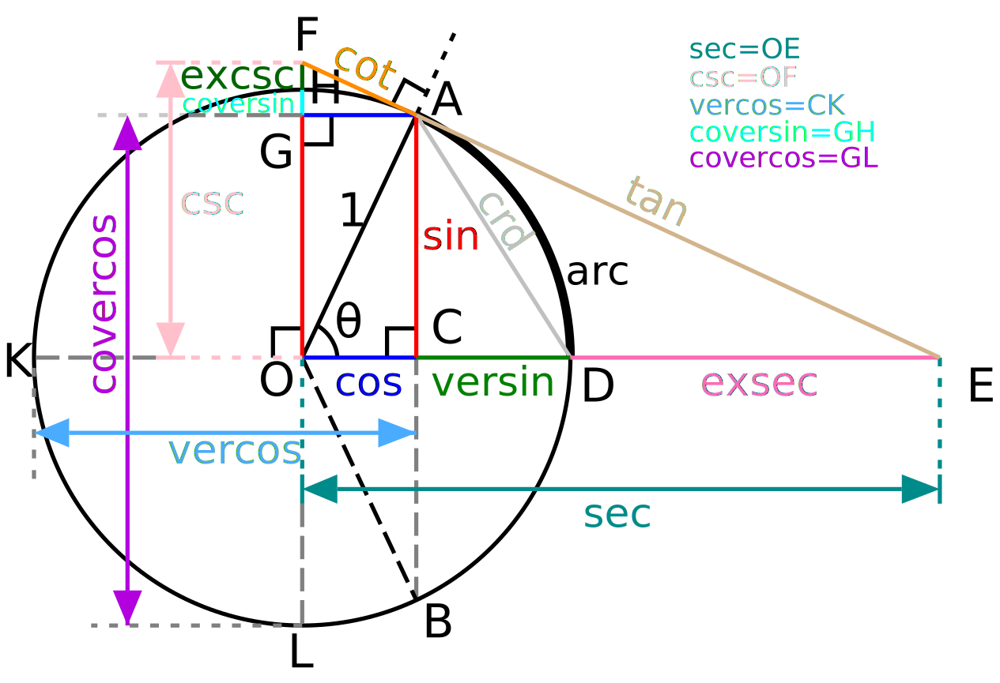

# 三角函数及三角函数线

## 三角函数的定义

### 直角三角形中的定义

直角三角形中仅有锐角（大小在0到90度之间的角）三角函数的定义。指定锐角 $\theta$，可以做出直角三角形，使一内角为 $\theta$。设三角形中$\theta$ 的对边、邻边和斜边长度分别是 $a, b, c$，那么则有：

$\theta$ 的正弦是对边与斜边的比值：$\sin{\theta}=\frac{a}{c}$

$\theta$ 的余弦是邻边与斜边的比值：$\cos{\theta}=\frac{b}{c}$

$\theta$ 的正切是对边与邻边的比值：$\tan{\theta}=\frac{a}{b}$

$\theta$ 的余切是邻边与对边的比值：$\cot{\theta}=\frac{b}{a}$

$\theta$ 的正割是斜边与邻边的比值：$\sec{\theta}=\frac{c}{b}$

$\theta$ 的余割是斜边与对边的比值：$\csc{\theta}=\frac{c}{a}$

同时，根据如上定义，又有：

$$\csc\theta=\frac{1}{\sin\theta}$$

$$\sec\theta=\frac{1}{\cos\theta}$$

$$\cot\theta=\frac{1}{\tan\theta}$$

### 笛卡尔坐标系中的定义

在平面直角坐标系中，可以定义任意角的三角比。

设 $P(x,y)$ 是平面直角坐标系 $xOy$ 中的一点，$\theta$ 是横轴正方向 $x$ 逆时针旋转到 $\vec{OP}$（有向线段）方向所形成的角，$r = \sqrt {x^2 + y^2}\in R^+$是点 $P$ 到原点 $O$ 的距离，则 $\theta$ 的六个三角函数定义为：

|正弦|余弦|正切|余切|正割|余割|
|:---:|:---:|:---:|:---:|:---:|:---:|
|$\sin\theta=\frac{y}{r}$|$\cos\theta=\frac{x}{r}$|$\tan\theta=\frac{y}{x}$|$\cot\theta=\frac{x}{y}$|$\sec\theta=\frac{r}{x}$|$\csc\theta=\frac{r}{y}$|

## 三角函数线

### 单位圆

三角函数也可以依据直角坐标系 $xOy$ 中半径为 $1$，圆心为原点 $O$ 的单位圆来定义。指定一角 $\theta$，设 $A(1,0)$ 为起始点，如果 $\theta>0$ 则将 $\vec{OA}$ 逆时针转动，如果 $\theta<0$ 则顺时针移动，直到转过的角度等于 $\theta$ 为止。那么最终点 $A$ 转到的位置为 $P(\cos\theta, \sin\theta)$。

### 三角函数线

依靠单位圆，可以构造出角 $\theta$ 的很多三角函数。

